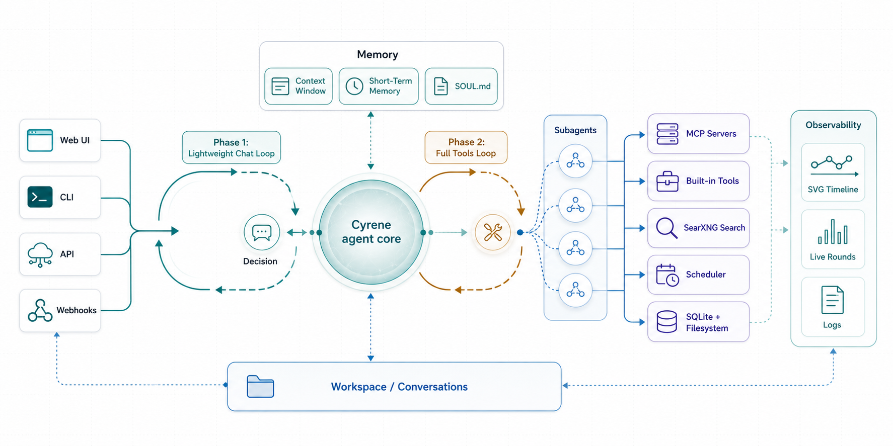

<p align="center">
  
  
  
</p>

<p align="center">
  
</p>

<h1 align="center">Cyrene — AI Agent That Evolves</h1>

<p align="center">
  An open-source AI agent framework with a living personality, parallel subagents,<br>
  and zero infrastructure. No Docker, no Redis, just Python.
</p>

---

## Why Cyrene?

| | Cyrene | Other frameworks |
|---|---|---|
| **Personality** | SOUL.md — a living document the agent rewrites itself. | Static system prompts. |
| **Memory** | Three-tier: context → compressed → long-term SOUL.md. | Single context window. |
| **Cost** | Two-phase loop: chat costs 1 LLM call, tools only when needed. | Every turn burns tool schemas. |
| **Search** | Built-in SearXNG via SimpleXNG. No Docker, no API key. | Bring your own or pay per-search. |
| **Infrastructure** | SQLite + filesystem. That's it. | Docker, Redis, Qdrant, S3, K8s. |
| **MCP** | Connects to any MCP server. | Vendor-locked or no standard. |
| **Observability** | Real-time SVG agent timeline in the browser. | Log files. |
| **Subagents** | Inbox-based parallel workers. | Thread-based or none. |

## Quick Start

```bash
conda create -n cyrene python=3.12 -y
conda activate cyrene
pip install -e .
cp .env.example .env
# Edit .env with your API key
PYTHONPATH=src python -m cyrene.local_cli --web
```

Open `http://localhost:4242`. First launch runs a personality setup wizard.

> **Windows?** See [docs/installation.md](docs/installation.md#windows) for platform-specific setup.

## Documentation

- [Installation](docs/installation.md) — Linux, macOS, Windows, Docker alternatives
- [Architecture](docs/architecture.md) — Two-phase loop, features, project structure
- [Usage](docs/usage.md) — Web UI, CLI commands, in-conversation commands
- [Configuration](docs/configuration.md) — Environment variables reference
- [Development](docs/development.md) — Debugging, verbose logging, testing

## License

Apache 2.0
